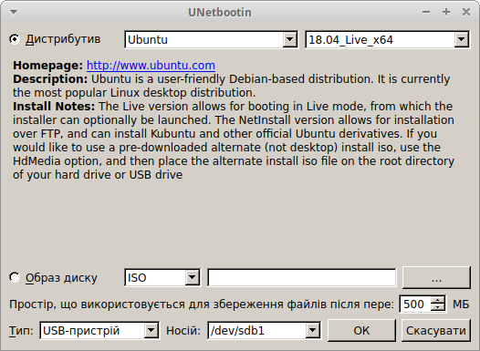

# Де взяти носій для встановлення Лінукс? #

Найлегше випробувати ОС Лінукс - спробувати так званий "живий диск". Це диск, який не потребує встановлення взагалі. А ще краще - звичайна флешка з операційною системою. Така система дозволяє випробувати різні дистрибутиви перед фінальним встановленням, оцінити зовнішній вигляд і самостійно визначити для себе основні переваги та недоліки конкретного дистрибутиву. Декому до вподоби використовувати таку флешку як особисту мобільну операційну систему, яку за крайньої потреби можна запустити на будь-якому доступному комп'ютері.

Попри існування великої кількості інструментів для створення завантажувальних USB носіїв мені особисто найбільше подобається UNetbootin [1]. Адже він підходить і Windows користувачам, і лінуксоїдам.

До того ж UNetBootin може сам скачати дистрибутив з сайту розробника. UNetBootin також можна використати й для того, щоб записати на флешку будь-який інший образ з диску вашого комп'ютера.

### Процедура ###

Секцію "Процедура" я часто починатиму словами "Все просто". Адже так воно і є.

Отже, все просто:

1. Встановлюємо Unetbootin. Інсталятор можна взяти на офіційному сайті [2]. А в Linux він є в офіційних репозитаріях більшості збірок.
2. Після запуску програми слід вибрати дистрибутив, його версію та носій, на який  будемо встановлювати наш Лінукс. Ось так виглядає UNetbootin:

Все, що нам треба зробити - обрати дистрибутив (згідно [3] найпоширеніші з них - MX Linux, Manjaro, Mint, Ubuntu, elementary, Debian). Популярність дистрибутивів постійно змінюється. Цілком можливо, що коли ви читатимете цей текст, їх вже може й не бути. Я, приміром, обрав собі Xubuntu. Чому? Бо я до нього звик. Він не вибагливий в ресурсах, має хороший набір програм з коробки і, зрештою, я не маю часу регулярно перевіряти кожен новий дистрибутив.

Xubuntu має Live версію, як і більшість популярних дитрибутивів. Саме Live версія Xubuntu встановлена у мене на флешці, тож за потреби, я можу нею скористатися на будь-якому доступному мені комп'ютері. Така версія дозволяє запускати систему безпосередньо з USB-носія не порушуючи роботу встановленої на комп'ютері системи. Це дозволяє ознайомитися з Лінуксом без зайвих загроз. Саме тому тим, хто вперше пробує Лінукс я рекомендую зупинитися саме на Live версії дистрибутива.

Далі щодо носія. Тут слід бути уважним, щоб не стерти важливі дані з флешки. Найкраще використати чистий носій. Тоді жодних небезпек не буде. Я ж зробив собі носій з двома розділами: один для збереження даних, а на іншому розміщений Live Xubuntu. Розділ для даних відформатований у FAT32. Тому його спокійно розпізнають як Лінукси так і Windows. 

Що може піти не так? Я зустрічався з випадками, коли певний дистрибутив ніяк не хотів запускатися, якщо він записаний за допомогою UNetbootin, та ці часи, схоже, далеко позаду. Просто звертаю увагу, що при будь-яких негараздах не варто лякатися. Досить спробувати інший інструмент створення завантажувального диску.

### Джерела: ###

[1](https://www.howtogeek.com/127377/the-best-free-tools-for-creating-a-bootable-windows-or-linux-usb-drive/)
[2](https://unetbootin.github.io/)
[3](https://distrowatch.com)

******
<html>

</html>

